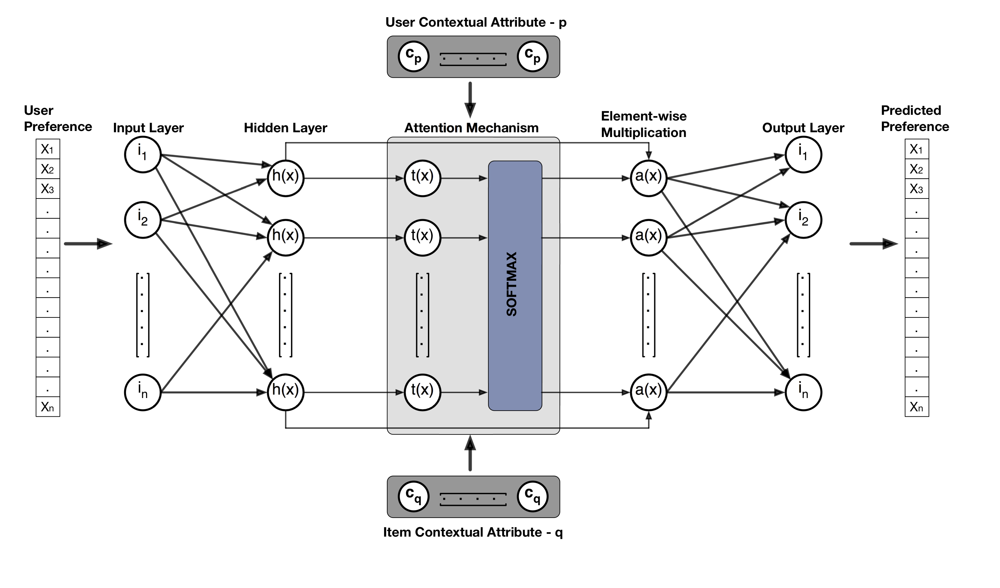

# ACDA - Attentive Contextual Denoising Autoencoder

## Overview
Attentive Contextual Denoising Autoencoder (ACDA) for top-N recommendation. The neural network architecture is based on the denoising autoencoder that incorporates contextual data via the attention mechanism to provide personalized recommendation. 
ACDA is a generic model that may be used for both rating prediction and top-N recommendation. This work focuses on the task of top-N recommendation.

## Architecture

The neural network architecture is provided below. There is one hidden layer and the context is applied to the hidden representation via the attention mechanism.
The model is flexible enough to accommodate any number of contextual parameters; however, only two contextual parameters are depicted in the diagram for reference.

 

## Datasets
The model is evaluated against two datasets for the event recommendation and movie recommendation tasks.
* Event recommendation is performed on the dataset from Meetup for events held in New York, San Francisco, Washington DC and Chicago.
* Movie recommendation is performed on the publicly available Movielens 100K dataset.

## Execution
* The event recommendation model is executed as: python3 event-adae.py <argument list>
	- Argument "--gpu": GPU to use for model execution.
	- Argument "--epochs": Number of iterations to train.
	- Argument "--size": Number of units in the hidden layer.
	- Argument "--neg_count": Number of negative samples to use for training.
	- Argument "--corrupt": Corruption ratio for the denoising autoencoder.
	- Argument "--save_dir": Directory to save the model.
	- Argument "--hidden_fn": Activation function to apply at the hidden layer. Default is ReLU.
	- Argument "--output_fn": Activation function to apply at the Output layer. Default is Sigmoid.
	- Argument "--nogroup": Group contextual factor is not applied.
	- Argument "--novenue": Venue contextual factor is not applied.
* The movie recommendation model is executed as: python3 movie-adae.py <argument list>
	- Argument "--gpu": GPU to use for model execution.
	- Argument "--epochs": Number of iterations to train.
	- Argument "--size": Number of units in the hidden layer.
	- Argument "--neg_count": Number of negative samples to use for training.
	- Argument "--corrupt": Corruption ratio for the denoising autoencoder.
	- Argument "--save_dir": Directory to save the model.
	- Argument "--hidden_fn": Activation function to apply at the hidden layer. Default is ReLU.
	- Argument "--output_fn": Activation function to apply at the Output layer. Default is Sigmoid.
	- Argument "--nogenre": Genre contextual factor is not applied.
